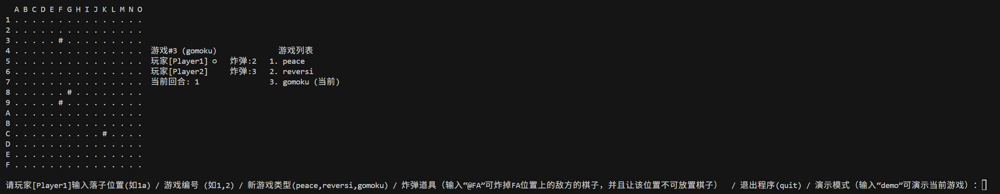
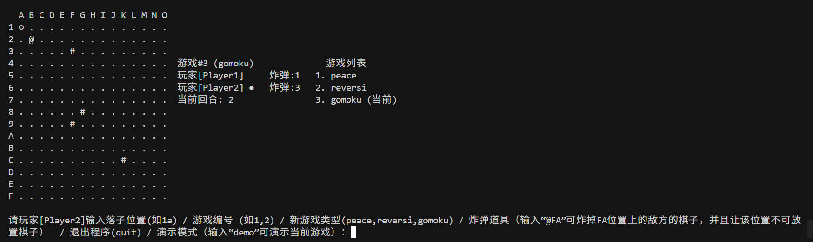
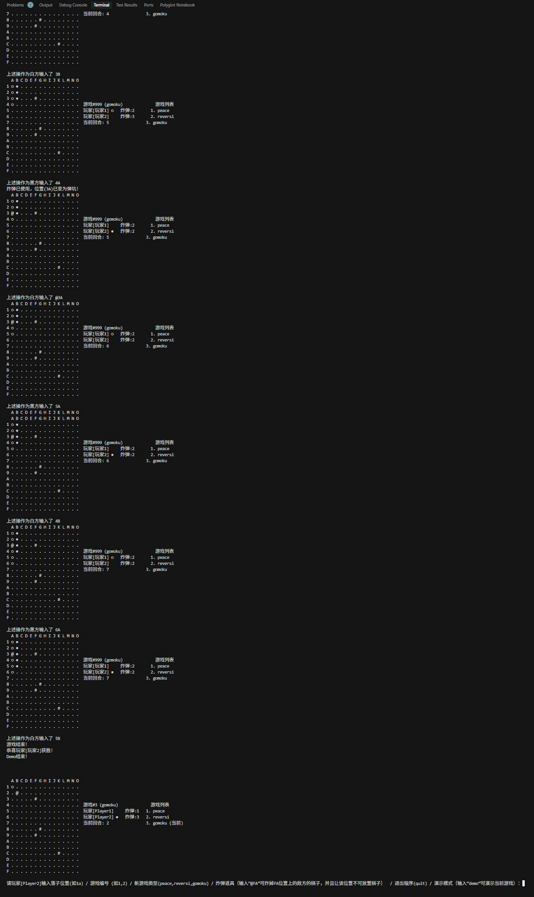

# Lab6
---

Github：[https://github.com/SeleiXi/FDU-SOFT130059-Object-Oriented-Programming/](https://github.com/SeleiXi/FDU-SOFT130059-Object-Oriented-Programming/)

---

## 运行方式

### Docker

```
docker pull seleixi/soft130059:latest
docker run -it seleixi/soft130059:latest
```

### Maven

```
mvn clean package
java -jar target/chess-game-1.0-SNAPSHOT.jar
```

### jar包

```
java -jar target/chess-game-1.0-SNAPSHOT.jar
```

## 游戏模式及运行截图

### 棋盘规模及障碍物
1. 五⼦棋盘增⼤为15*15
2. ⾏号采⽤16进制1-F
3. 列号采⽤字⺟A-O
4. 五⼦棋盘初始增设Barrier（符号#）：随机挑选四个位置放置障碍物，障碍物位置⽆法落⼦,在本次lab中，障碍物位置固定为3F、8G、9F、CK



### 新增道具模式-炸弹BOMB
1. 输⼊@⾏列(e.g.,@FA)使⽤炸弹
2. 使⽤后可移除对⽅任意⼀颗棋⼦，并将移除的位置放置⼀个⽆法落⼦的弹坑（符号@）
3. 使⽤时机：可在⾃⼰回合选择使⽤道具代替落⼦
4. 初始⽩⽅有3个炸弹，⿊⽅有2个炸弹，以此消除⿊⽅先⼿的优势
5. 当前剩余的炸弹数量需要显⽰在玩家状态的列表中

__黑方输入@2b后，白方位于2b的棋子变成@，并且炸弹数量-1



### 新增demo模式
demo模式中系统会⾃动操作游戏，以展⽰游戏的玩法
1. demo模式不会影响当前棋盘行棋
2. demo模式过后，会自动显示回当前棋盘的状态
3. demo展示了行棋规则、胜利条件、如何使用bomb等必要信息
4. demo模式附带了执行了什么操作的解释

