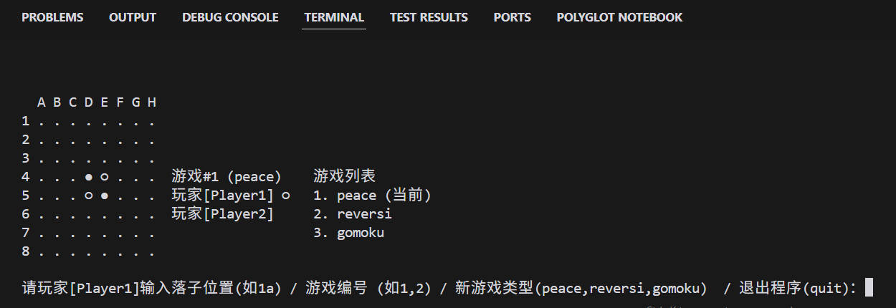
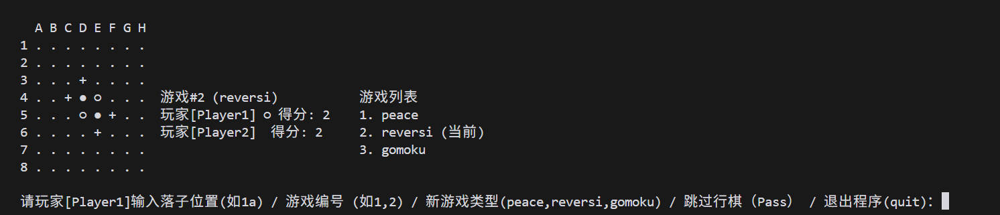
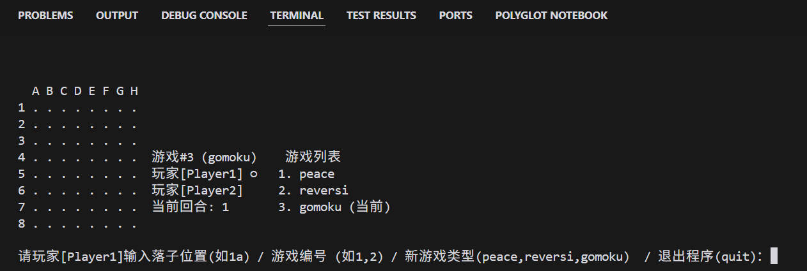
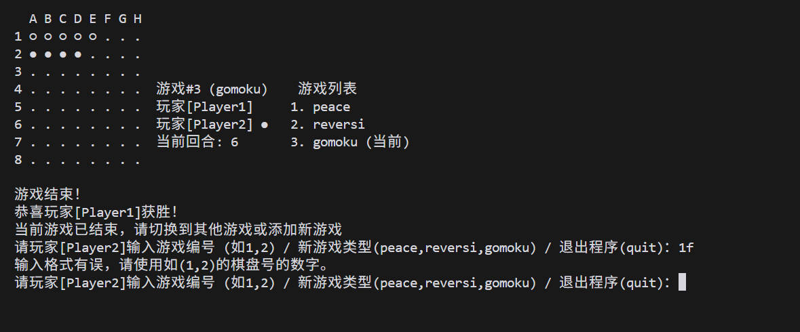
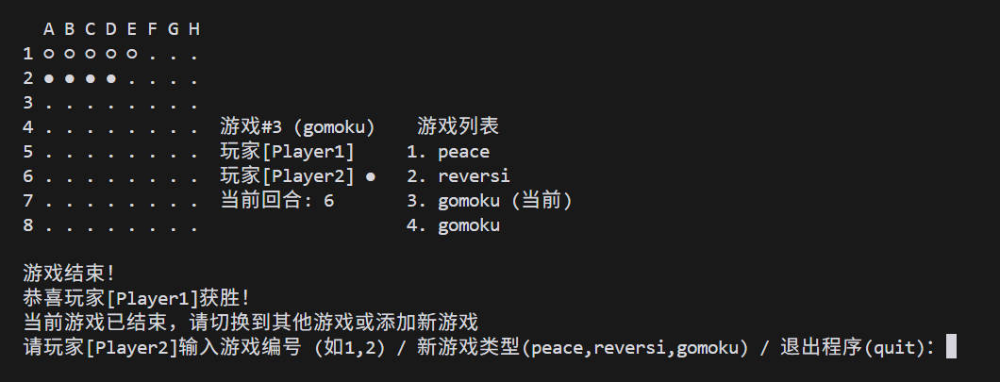

# Lab4
---

Github：[https://github.com/SeleiXi/FDU-SOFT130059-Object-Oriented-Programming/](https://github.com/SeleiXi/FDU-SOFT130059-Object-Oriented-Programming/)

---

## 运行方式

### Docker

```
docker pull seleixi/soft130059:latest
docker run -it seleixi/soft130059:latest
```

### Maven

```
mvn clean package
java -jar target/chess-game-1.0-SNAPSHOT.jar
```

### jar包

```
java -jar target/chess-game-1.0-SNAPSHOT.jar
```

## 游戏模式及运行截图

### Peace
- 基本规则：玩家轮流在棋盘上放置棋子，棋子只能放在空位置上
- 游戏结束：当所有棋盘都满时游戏结束


### Reversi
- 基本规则：玩家轮流在棋盘上放置棋子，并翻转被夹住的对手棋子
- 合法落子：必须能够夹住对手至少一个棋子
- Pass规则：当玩家没有合法落子位置时，自动让对手行棋
- 游戏结束：当双方都无法落子或棋盘已满时结束
- 胜负判定：以棋盘上各自颜色棋子数量决定胜负


### Gomoku
- 初始化时为空棋盘
- 支持【当前回合】打印


- 胜利条件为5个同色棋子连在一起，且一方胜利时无法继续下棋


- 游戏结束时，可以新增gomoku棋盘，且无论是新增模式后 / 切换回棋盘时，仍然显示该棋盘的胜利信息



## 开发细节

- 继承关系：GomokuGame继承Game类，实现特有的游戏规则
- 多态应用：通过override实现不同游戏模式的差异化逻辑
- 封装：各类通过私有变量与公开方法实现良好封装
- 代码重用：核心游戏功能集中在父类中，子类只实现特殊功能
- 灵活性：通过常量控制多项游戏参数，避免硬编码 