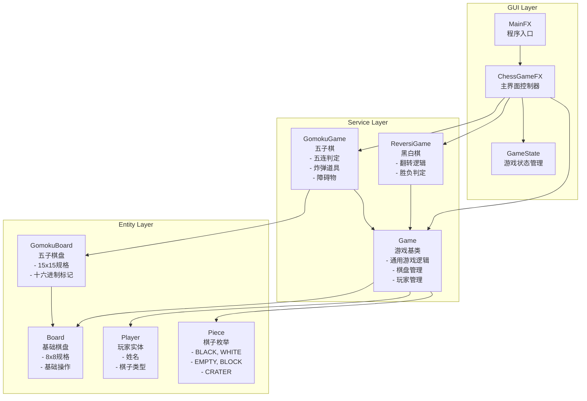
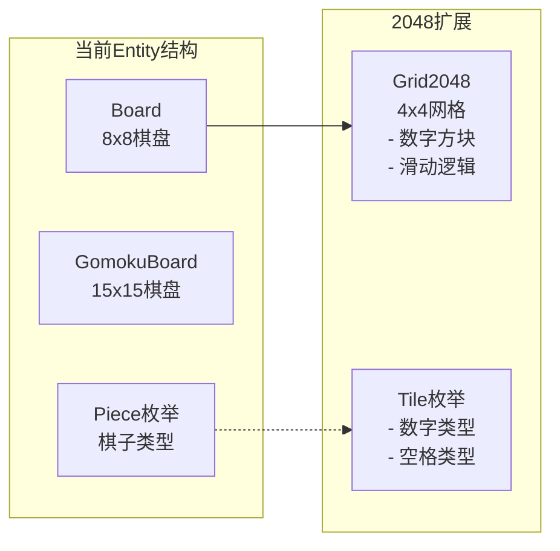
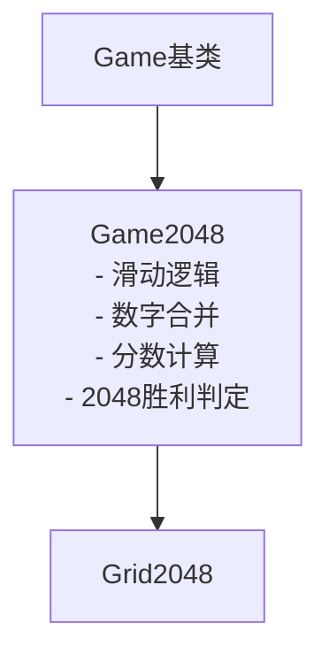

## 代码结构说明


```mermaid
graph TB
    subgraph "GUI Layer"
        ChessGameFX["ChessGameFX<br/>主界面控制器"]
        GameState["GameState<br/>游戏状态管理"]
        MainFX["MainFX<br/>程序入口"]
    end
    
    subgraph "Service Layer"
        Game["Game<br/>游戏基类<br/>- 通用游戏逻辑<br/>- 棋盘管理<br/>- 玩家管理"]
        ReversiGame["ReversiGame<br/>黑白棋<br/>- 翻转逻辑<br/>- 胜负判定"]
        GomokuGame["GomokuGame<br/>五子棋<br/>- 五连判定<br/>- 炸弹道具<br/>- 障碍物"]
    end
    
    subgraph "Entity Layer"
        Board["Board<br/>基础棋盘<br/>- 8x8规格<br/>- 基础操作"]
        GomokuBoard["GomokuBoard<br/>五子棋盘<br/>- 15x15规格<br/>- 十六进制标记"]
        Player["Player<br/>玩家实体<br/>- 姓名<br/>- 棋子类型"]
        Piece["Piece<br/>棋子枚举<br/>- BLACK, WHITE<br/>- EMPTY, BLOCK<br/>- CRATER"]
    end
    
    ChessGameFX --> Game
    ChessGameFX --> ReversiGame
    ChessGameFX --> GomokuGame
    ChessGameFX --> GameState
    
    Game --> Board
    Game --> Player
    Game --> Piece
    
    ReversiGame --> Game
    GomokuGame --> Game
    GomokuGame --> GomokuBoard
    
    GomokuBoard --> Board
    
    MainFX --> ChessGameFX
```

### 主要模块关系说明

#### 1. GUI层 (com.chess.gui)
- **ChessGameFX**: 主界面控制器，负责用户界面渲染、事件处理、游戏状态展示
- **GameState**: 游戏状态持久化管理，负责保存/加载游戏进度
- **MainFX**: JavaFX应用程序入口点

#### 2. Service层 (com.chess.service)
- **Game**: 抽象游戏基类，定义通用游戏逻辑和框架
  - 游戏模式枚举 (PEACE, REVERSI, GOMOKU)
  - 棋盘和玩家管理
  - 基础游戏流程控制
  - 游戏列表和切换机制
- **ReversiGame**: 黑白棋具体实现，继承自Game
  - 重写落子逻辑，实现棋子翻转
  - 特殊的胜负判定规则
- **GomokuGame**: 五子棋具体实现，继承自Game
  - 使用15x15棋盘
  - 实现五连胜判定
  - 添加炸弹道具和障碍物系统

#### 3. Entity层 (com.chess.entity)
- **Board**: 基础棋盘类 (8x8)
  - 棋盘初始化和状态管理
  - 棋子放置和获取
- **GomokuBoard**: 五子棋专用棋盘 (15x15)
  - 继承Board，扩展为15x15规格
  - 十六进制行标记解析
- **Player**: 玩家实体类
- **Piece**: 棋子类型枚举

### 设计模式使用

1. **继承模式**: Game基类定义通用框架，子类实现具体游戏逻辑
2. **模板方法模式**: Game类定义游戏流程模板，子类重写关键方法
3. **策略模式**: 不同游戏类型使用不同的胜负判定策略
4. **单例模式**: GameState管理全局游戏状态

---

## 添加新游戏类型分析

### 以2048游戏为例的扩展方案

如需要添加2048游戏类型，需要在现有架构上进行以下调整：

#### 1. Entity层扩展


```mermaid
graph LR
    subgraph "当前Entity结构"
        Board["Board<br/>8x8棋盘"]
        GomokuBoard["GomokuBoard<br/>15x15棋盘"]
        Piece["Piece枚举<br/>棋子类型"]
    end
    
    subgraph "2048扩展"
        Grid2048["Grid2048<br/>4x4网格<br/>- 数字方块<br/>- 滑动逻辑"]
        Tile["Tile枚举<br/>- 数字类型<br/>- 空格类型"]
    end
    
    Board --> Grid2048
    Piece -.-> Tile
```

**需要添加的类：**
- `Grid2048`: 继承自Board，实现4x4网格
- `Tile`: 新的枚举类型，表示2048游戏中的数字方块

#### 2. Service层扩展


```mermaid
graph TB
    Game["Game基类"] --> Game2048["Game2048<br/>- 滑动逻辑<br/>- 数字合并<br/>- 分数计算<br/>- 2048胜利判定"]
    
    Game2048 --> Grid2048["Grid2048"]
```

**需要添加的类：**
- `Game2048`: 继承自Game类，实现2048特定逻辑
  - 重写`initializeBoard()`: 初始化4x4网格
  - 重写`processMoveInput()`: 处理方向键输入(上下左右)
  - 重写`checkGameEnd()`: 检查2048胜利条件或无法移动
  - 添加`slideAndMerge()`: 滑动和合并逻辑
  - 添加`addRandomTile()`: 随机添加新数字方块

#### 3. GUI层调整

**ChessGameFX类需要的修改：**
- 添加2048游戏类型到游戏列表
- 修改棋盘渲染逻辑，支持数字显示而非棋子
- 添加方向键监听器，替换鼠标点击
- 修改得分显示，添加2048特有的分数系统

#### 4. 枚举扩展

**Game.GameMode枚举添加：**
```java
public enum GameMode {
    PEACE("peace"),
    REVERSI("reversi"), 
    GOMOKU("gomoku"),
    GAME2048("2048");  // 新增
    // ...
}
```

#### 5. 具体实现步骤

1. **创建Grid2048类** (继承Board)
   - 重写为4x4网格
   - 添加滑动和合并方法

2. **创建Tile枚举**
   - 定义数字方块类型 (2, 4, 8, 16, ..., 2048)
   - 定义空格类型

3. **创建Game2048类** (继承Game)
   - 实现2048特有的游戏逻辑
   - 重写关键方法适配2048规则

4. **修改ChessGameFX**
   - 添加2048游戏到初始化列表
   - 修改UI渲染逻辑支持数字显示
   - 添加键盘事件处理

5. **更新GameState**
   - 确保新游戏类型可以正确序列化/反序列化

### 架构优势

现有架构的优势在于：
- **高扩展性**: 通过继承Game基类，新游戏类型可以复用大量通用逻辑
- **松耦合**: GUI层与游戏逻辑分离，便于独立修改
- **一致性**: 所有游戏类型遵循相同的接口和生命周期
- **可维护性**: 清晰的分层结构，职责明确

通过这种设计，添加新游戏类型只需最小化修改现有代码，主要工作集中在实现新游戏的特定逻辑上。

---
